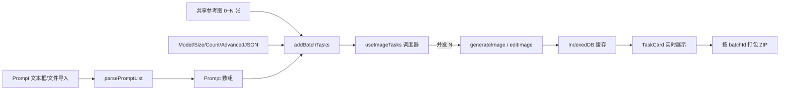

# 🏭 批量生图流水线设计方案（Prompt List Driven）

## 一、设计理念

1. **复用胜于重写**：项目里 `useImageTasks` 的并发调度、IndexedDB 缓存、TaskCard 进度展示已经全部就绪。这个面板的工作只是"把一堆 prompt 喂进现成的队列"。
2. **Prompt 列表是一等公民**：不发明 CSV/JSON，就是最朴素的"一行一个 prompt"的纯文本。可粘贴、可导入 `.txt` / `.md` / `.csv` 文件，任何文本编辑器都能编辑。
3. **共享配置，不做行级覆盖**：所有任务共享同一组参考图、同一个 model、同一个 size、同一份 Advanced JSON。要差异化？再加一行 prompt 就行。**保持单一变量**，避免 CSV 那种"每行各自参数"的复杂度（真要差异化时再迭代）。
4. **批次可追溯**：一次提交属于同一个 `batchId`，可按批次筛选、按批次打包导出。

---

## 二、数据流



参考图为 0 张 → 走 `generateImage`（文生图）。
参考图 ≥ 1 张 → 走 `editImage`（图生图，所有任务共用同一组参考图）。

---

## 三、核心实现细节

### 1. Prompt 列表解析（`lib/promptList.ts`，新增）

输入：纯文本字符串。规则：

* **一行一条**：`split(/\r?\n/)`
* **空行跳过**
* **`#` 开头的整行视为注释，跳过**（方便用户在 prompt 文件里做分组、加备注）
* **行首/行尾 trim**
* **去重默认关闭**（同一个 prompt 跑多次可能就是用户的意图，比如配 `count=3` 拿不同 seed 的变体）

举例：

```
# 角色立绘批次 1 - 战士系列
a heavily armored knight standing on a cliff, sunset
a young female mage casting a fire spell, dynamic pose

# 角色立绘批次 2 - 法师系列
an old wizard with a crystal staff, library background
```

→ 解析为 3 条 prompt，注释和空行被丢弃。

### 2. 文件导入

* 支持后缀：`.txt` / `.md` / `.csv`（CSV 此版本只取第一列，不解析多列）
* 拖拽 + 点击选择
* 读完直接填进文本框，**用户还能继续编辑** —— 文本框始终是真相之源（single source of truth）。
* **不持久化文件本身**，只把文本内容存到 `localStorage`，刷新不丢失（key: `openai-image-webui:batch-prompts`）。

### 3. 调度入口（扩展 `useImageTasks`）

新增方法：

```ts
addBatchTasks(input: {
  prompts: string[];
  inputImages?: InputImageFile[];
  mask?: InputImageFile | null;
  sharedConfig: {
    model: string;
    size: string;
    count: number;          // 每条 prompt 跑几次
    advancedJson?: string;
  };
  batchId: string;          // 由调用方生成，便于关联
}): void
```

行为：把 `prompts.length × count` 条 task 一次性塞进队列；现有 `useEffect` 调度器自动按 `concurrency` 并发处理。**调度器本身一行不改**。

每条 task 在 `extraParams` 里附加：

```json
{ "_batchId": "batch_260604_1507_3a8f", "_batchIndex": 12 }
```

`_` 前缀字段不会被传给 API（在 `generateImage` / `editImage` 入口处过滤掉，只用于本地标记）。

### 4. 批次 ID 生成

格式：`batch_YYMMDD_HHmm_<4位hex>`，例 `batch_260604_1507_3a8f`。

* 前缀 `batch_` 便于识别
* 时间戳便于人眼排序
* 4 位 hex 防同分钟撞车

### 5. 进度展示

* **顶部进度条**：`已完成 / 总数`，例 `12 / 50  (3 running, 1 error)`
* **任务卡片**：直接复用全局 `TaskQueue` —— 不再像 `BatchRenamePanel` 那样自管一套行内列表。批量任务会和其他单发任务混在同一个队列里（通过 `_batchId` 可筛选）。
* **失败重试**：复用 `TaskCard` 的 retry 按钮。新增"只重跑此批次失败项"按钮：遍历 `tasks`，筛 `_batchId === currentBatch && status === "error"`，逐个 `retryTask`。

### 6. 批次导出（`lib/batchExport.ts`，新增）

按 `_batchId` 收集所有 `success` 任务 → 从 IndexedDB 取 Blob → JSZip 打包。

文件命名规则（默认）：

```
{batchId}/
  001_{prompt前30字符slug}.png
  002_{prompt前30字符slug}.png
  ...
  prompts.txt              # 原始 prompt 列表（保留顺序对应关系）
  manifest.json            # 任务元数据：prompt / model / size / 用时 / 是否成功
```

`manifest.json` 让用户事后能复盘"哪条 prompt 出了哪张图"。

### 7. 容量限制调整（必须改）

现状对批量是个隐患，要顺手改两个常量：

| 文件:位置 | 现值 | 调整 | 原因 |
|---|---|---|---|
| `lib/storage.ts` 的 `tasks.slice(-100)` | 保留 100 条 | 提升到 500（或改成可配置） | 批量一次就可能 100+ |
| `components/TaskQueue.tsx` 的 `MAX_RENDERED_TASKS=100` | 渲染上限 100 | 提升到 200，或加虚拟滚动 | 同上 |

> 图片本体在 IndexedDB（200MB 警戒线），**这个容量是够用的**。要改的只是任务元数据上限和渲染上限。

---

## 四、UI 设计（极简）

新增第四个 mode：`generate` / `vision` / `rename` / **`batch`**。

```
┌─────────────────────────────────────────────────┐
│  Mode: [生成] [视觉] [重命名] [📋 批量]           │
├─────────────────────────────────────────────────┤
│                                                 │
│  ① Prompt 列表                                  │
│  ┌─────────────────────────────────────────┐   │
│  │ # 战士系列                              │   │
│  │ a heavily armored knight ...            │   │
│  │ a young female mage ...                 │   │
│  │                                         │   │
│  │ # 法师系列                              │   │
│  │ an old wizard ...                       │   │
│  └─────────────────────────────────────────┘   │
│  [📁 导入 .txt/.md/.csv]  [🗑 清空]              │
│  解析结果：3 条 prompt（已忽略 2 行注释、1 空行）│
│                                                 │
│  ② 共享参考图（可选，0~N 张）                   │
│  [拖拽或点击上传]  缩略图列表...                 │
│                                                 │
│  ③ 共享配置                                     │
│  Model: [gpt-image-1 ▼]                         │
│  Size:  [1024x1024 ▼]                           │
│  每条 prompt 重复: [1] 次                       │
│  Advanced JSON: { "quality": "high" }           │
│                                                 │
│  ④ 提交                                         │
│  预估总计：3 prompts × 1 = 3 张                 │
│  预估花费：≈ $0.12（参考 pricing.ts）           │
│  [🚀 开始批量生成]  [⏸ 暂停队列]                 │
│                                                 │
│  ⑤ 进度（嵌入式简版，详细看下方 TaskQueue）      │
│  当前批次 batch_260604_1507_3a8f                 │
│  ████████░░░░  12/50  (3 running, 1 error)      │
│  [🔁 只重跑失败项]  [📦 打包此批次 ZIP]          │
│                                                 │
└─────────────────────────────────────────────────┘
```

下方共用区域（`TaskQueue` / `ImageLibrary`）保持不变，批量任务自然汇入。

---

## 五、文件改动清单

| 类型 | 路径 | 说明 |
|---|---|---|
| 新增 | `src/lib/promptList.ts` | 解析、统计、去重（可选） |
| 新增 | `src/lib/batchExport.ts` | 按 batchId 打包 ZIP + manifest.json |
| 新增 | `src/components/BatchGenerationPanel.tsx` | 主面板 UI |
| 修改 | `src/hooks/useImageTasks.ts` | 加 `addBatchTasks` 方法；retry 失败项的批量入口 |
| 修改 | `src/types/index.ts` | `WorkspaceMode` 加 `"batch"`；`ImageTask.extraParams` 已是任意对象，无需改 |
| 修改 | `src/App.tsx` | tab 加一项；分支渲染 |
| 修改 | `src/lib/storage.ts` | 任务上限 100 → 500 |
| 修改 | `src/components/TaskQueue.tsx` | 渲染上限 100 → 200 |
| 修改 | `src/api/openaiImages.ts` | 过滤 `_` 前缀的内部字段，不发给 API |
| 修改 | `src/i18n/resources.ts` | 加 `batch.*` 文案 |

**估算**：核心 6~8 小时（不含联调和打磨）。

---

## 六、刻意不做的事

> 这些不是"忘了"，是"现在不做"。等用过几次再看要不要补。

1. **不做 CSV 多列参数**：每行 prompt 自带 size/model 这种行级配置，第一版不上。复杂度暴涨，先看真实需求。
2. **不做模板变量**：比如 `a {color} {animal} on the moon`，配一个变量表笛卡尔积。同上，等用过再说。
3. **不抽 `<InputImageUploader>` 公共组件**：当前三处重复有差异（mask 槽位、PNG 严格模式等），这次先复制 GenerationPanel 那一套到 BatchGenerationPanel，**让重复呆一阵子**，看清楚差异点之后再抽，比现在硬抽更准。
4. **不做断点续跑**：浏览器关了就关了。批量场景里这个值得做，但要改持久化层，先不做，看实际有没有人遇到这个痛点。
5. **不做"暂停队列"按钮**：`useImageTasks` 当前没有"全局暂停"概念，加这个要改调度器。第一版只支持"取消单个任务"。

---

## 七、风险与限制

* **刷新会取消正在跑的任务**：现有设计如此（`storage.ts` 的 `restoreTask` 把 `pending/running` 强制转 `cancelled`）。批量场景里这个体验更明显，要在 UI 上明确提示"刷新会中断"。
* **CORS 问题不变**：批量不会让 CORS 变好或变坏，沿用现有 SettingsPanel 的提示。
* **API 限速 / 429**：现有调度器没有指数退避，只是直接报 error。批量大场景下 429 概率上升，**这个比刷新中断更值得做**——但放到第二版（看实际频率）。

---

## 八、做完之后的验收清单

- [ ] 粘贴 10 行 prompt（含注释、空行），点击开始，10 个 task 出现在队列里
- [ ] 导入一个 `.txt` 文件，文本框自动填充
- [ ] 上传 2 张参考图，所有任务共用，走 `/images/edits`
- [ ] 一条 prompt 故意写错（比如超长触发 API 报错），看到 error 状态
- [ ] 点"只重跑失败项"，错的那条重新跑
- [ ] 点"打包此批次 ZIP"，得到 zip 里有图 + prompts.txt + manifest.json
- [ ] 关闭浏览器再打开，task 元数据还在（图也还在 IndexedDB）
- [ ] 切换到普通生成 mode，单发任务依然正常（互不干扰）
